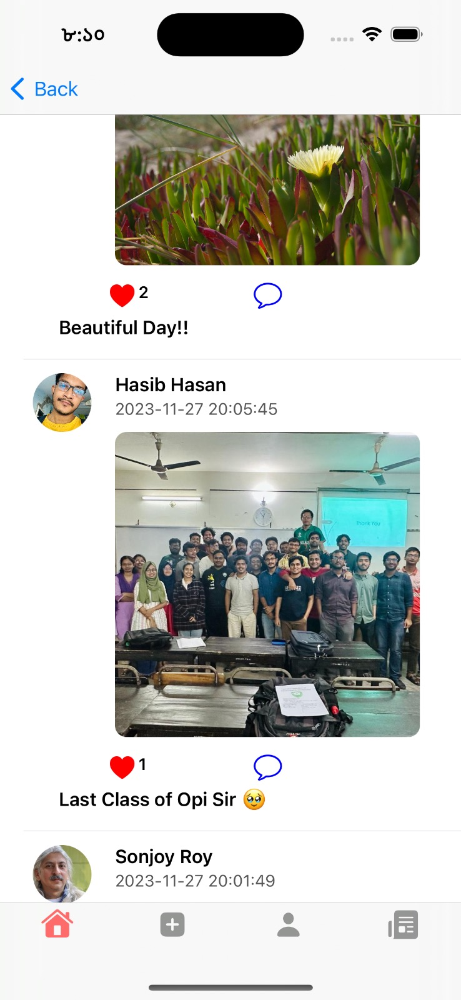
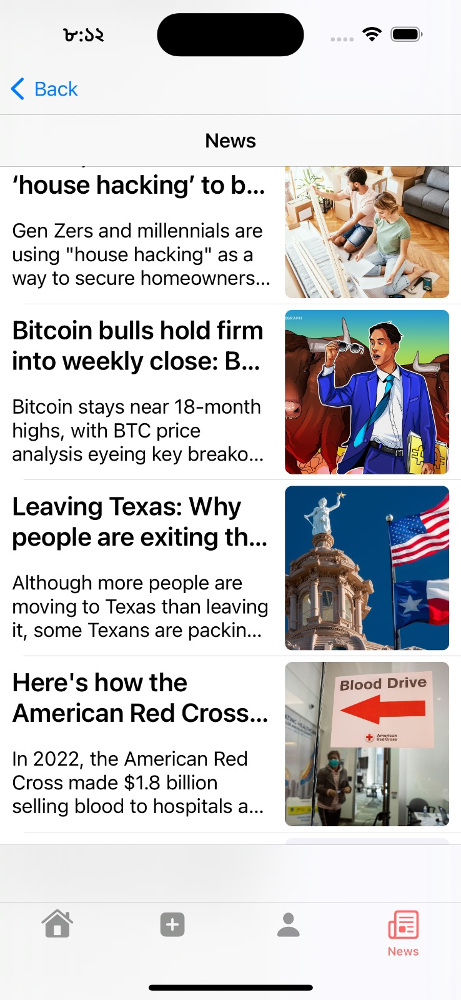
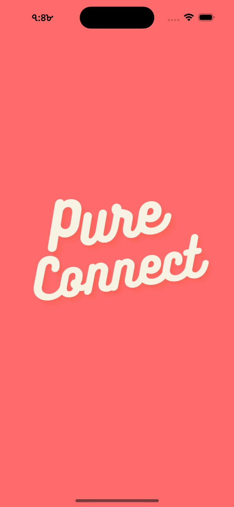

# 🌐 PureConnect

PureConnect is a social media platform where users can post, like, comment, and interact with a streamlined timeline view. Built with Firebase integration and clean UI design, PureConnect provides a robust and interactive user experience.

---

## 🚀 Features

- 🌟 **User Authentication**: Sign up and sign in with Firebase.
- 🖼️ **Post Creation**: Upload images and descriptions.
- ❤️ **Interaction**: Like and comment on posts.
- 📰 **News Feed**: Fetch and display real-time news.
- ⚙️ **Profile Management**: Update user profiles with ease.

---

## 🛠️ Installation
- Clone the repository:
   ```bash
   git clone https://github.com/username/PureConnect.git
   cd PureConnect
- Open the project in Xcode
- Install Dependencies: Firebase SDK, News API Setup
- Run the project on an IOS device

## 📸 Screenshots

### 1. Sign In
<p align="center">
  <span>
    
  </span>
</p>

### 2. Create Post
<p align="center">
  <span>
    
  </span>
</p>

### 3. Login
<p align="center">
  <span>
    
  </span>
</p>


### 4. All Posts
<p align="center">
  <span>
    
  </span>
</p>


### 5. News Feed
<p align="center">
  <span>
    
  </span>
</p>

### 6. User Profile
<p align="center">
  <span>
    
  </span>
</p>

### 7. News API
<p align="center">
  <span>
    
  </span>
</p>

### 8. Reaction
<p align="center">
  <span>
    
  </span>
</p>

### 9. Comments
<p align="center">
  <span>
    
  </span>
</p>

### 9. App
<p align="center">
  <span>
    
  </span>
</p>


---

## 🔧 Technologies Used

- **Swift** for development.
- **Firebase** for authentication, storage, and database.
- **NewsAPI** for fetching real-time news articles.

---

## 📄 License

This project is licensed under the MIT License - see the [LICENSE](LICENSE) file for details.


### Contributions
- **Israt Tasnim Esha** (Roll: 1907090) 👨‍💻
- **Md. Safwan Zaher Asif** (Roll: 1907066) 👨‍💻
- **Sonjoy Roy** (Roll: 1907073) 👨‍💻
- **Jobair Al Nahian** (Roll: 1907071) 👨‍💻
- **Hasibul Hasan Hasib** (Roll: 1907089) 👨‍💻


**Khulna University of Engineering & Technology** 🏫
